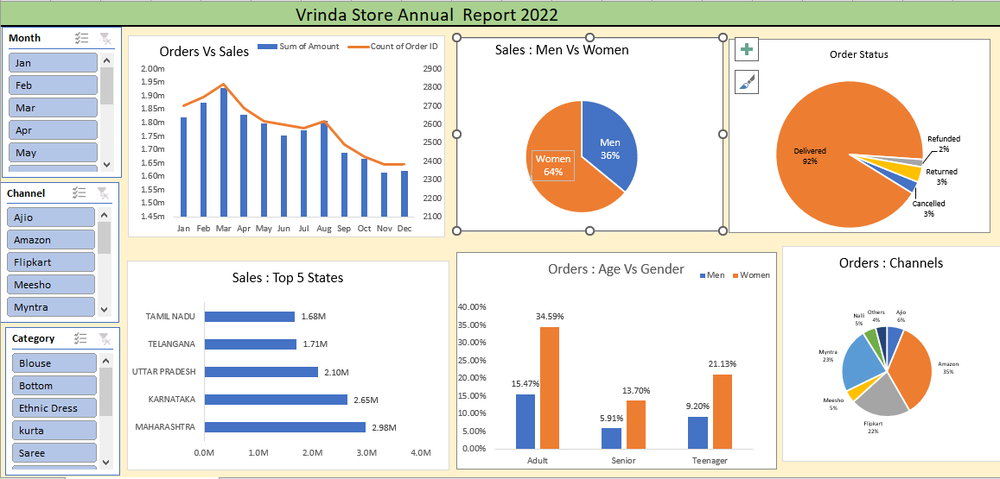

# Vrinda Store Data Analysis Report (2022)

📌 Project Overview
The objective of this project is to analyze the sales data of "Vrinda Store" for the year 2022. By performing data cleaning, processing, and visualization, the goal is to provide actionable insights into customer behavior and sales trends to help the business grow in 2023.

📊 Key Business Questions
1. Compare Sales and Orders using a single chart.

2. Which month had the highest sales and orders?

3. Who purchased more: Men or Women? 

4. What are the different order statuses (Delivered, Refunded, Cancelled, etc.)?

5. List the top 5 states contributing to sales. 

6. What is the relationship between age and gender regarding order count? 

7. Which sales channel is contributing the most (Amazon, Flipkart, Myntra, etc.)?

🛠️ Tech Stack & Tools
Tool: Microsoft Excel

Techniques Used: * Data Cleaning (Handling nulls, standardizing text, replacing values)

Data Processing (Creating age groups and extracting months) 

Pivot Tables & Pivot Charts 

Slicers for Interactive Dashboards

🚀 Process Workflow
Data Cleaning: Standardized the Gender column (replacing M/W with Male/Female) and ensured numeric consistency in Size and Amount columns. 

Data Processing: Added a new Age Group column (Teenager, Adult, Senior) and a Month column extracted from order dates to facilitate time-series analysis. 

Data Analysis: Built multiple Pivot Tables to calculate sums and counts of sales data across different dimensions.

Data Visualization: Created an interactive dashboard featuring:

Combo Charts for Sales vs. Orders.

Pie Charts for Gender and Channel distribution.

Bar Charts for Top 5 States.

Dashboarding: Integrated Slicers (Month, Channel, Category) to allow users to filter the entire report dynamically. 

📈 Final Insights & Conclusion
Target Audience: Women in the "Adult" age group (30-49 years) are the primary customers, contributing ~35% of total sales. 

Top Channels: Amazon, Flipkart, and Myntra contribute nearly 80% of total sales.

Top Regions: Maharashtra, Karnataka, and Uttar Pradesh are the highest-performing states.

Recommendation: To increase revenue, the store should target women aged 30-49 in the top 3 states using tailored ads and coupons on Amazon and Flipkart.

🔗 Reference
Tutorial Video: Full Project in Excel with Interactive Dashboard by Rishabh Mishra.
